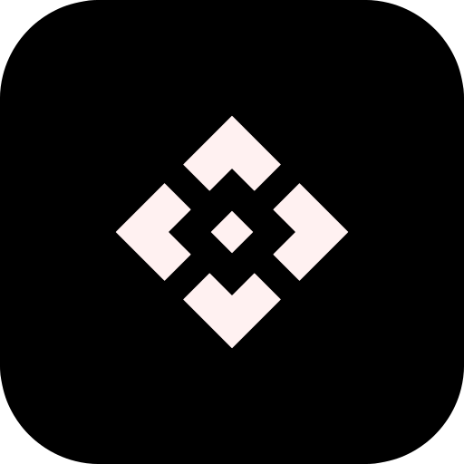

" align="right">

# **HyperLightBCL**
#####
**```A Faster and More Convenient HyperLightBCL For Rust```**
#####
[简体中文](README_ZH_CN.md)
[繁體中文](README_ZH_TW.md)
#####
**A BCL-Launcher Core branch, a faster and more stable graphical GUI launcher built with Rust**
#####

> [!WARNING]
> * **This Project is a separate development branch from the Python-written [BCL-Launcher](https://github.com/DCR-Studio/BCL-Launcher) Core!**
> * **HyperLightBCL is still in early development. Bugs are inevitable in this early stage, so daily use is not recommended. If you find a bug, please report it to our Issues. Thank you!**
> * **The Project is licensed under the GNU General Public License 3.0 Open Source License, and features are being continuously added**

#####

## **📆  Development Progress**
**The following is information and progress on planned feature additions**

#####

### **✓ Completed Features:**

* [x] **Offline Login and Microsoft OAuth Login**

### **🛠️ Planned / Completed Features:**

* [ ] **Launch the game**
* [ ] **Game version download and installation**
* [ ] **Download and install CurseForge and Modrinth mods, resources, save files, shaders, and modpacks**
* [ ] **Traditional Yggdrasil API and OAuth 2.0 Yggdrasil API Login**
* [ ] **More features to be added......**

#####

## **? How to use?**

- **Build and Download via Github Actions**
- **Configure the Rust Development Environment for Compilation (for Developers)**
#####
### > **📦 Building Steps:**

**If you don't want to download HyperLightBCL via Github Actions and want to experience new features immediately, please configure your Rust development environment and run the following command to compile:**

```bash
git clone git@github.com:DCR-Studio/HyperLightBCL.git
cd HyperLightBCL
cargo build --release
```

**After compilation, the files will be stored in the target/release folder**

**If you want to test HyperLightBCL before compiling, and you're a developer proficient in Rust, you can use the following command:**

```bash
git clone git@github.com:DCR-Studio/HyperLightBCL.git
cd HyperLightBCL
cargo run
```

#####
## **📖 License**

**We sincerely hope that community developers can contribute some code to us, so we choose to open source the source code**

**HyperLightBCL is licensed under **[GPL-3.0 license](LICENSE)** Open Source License, this agreement is contagious**

#####

### Additional Terms (Pursuant to Section 7 of the GPLv3 License)

1. When distributing a modified version of this program, you must reasonably modify the program's name or version number to distinguish it from the original version. (According to [GPLv3, 7(c)](https://github.com/DCR-Studio/HyperLightBCL/blob/main/LICENSE#L372-L374))
    - Modified versions **must not include the original program name "Bad Craft Launcher" "HyperLightBCL" or its abbreviation "BCL" in their name, nor use any name that is similar enough to cause confusion with the official name**.
    - All modified versions **must clearly indicate that they are “Unofficial Modified Versions” on the program’s startup screen or main interface**.

2. You must not remove the copyright notices displayed by the program. (According to [GPLv3, 7(b)](https://github.com/DCR-Studio/HyperLightBCL/blob/main/LICENSE#L368-L370))

#####
**Copyright ©2024-2025 DCR Studio and contributors. All rights reserved**
